# Comprehensive Analysis Report: Qualitative Visualization in Research (QUIVR)

## Table of Contents

1.  [Abstract](#1-abstract)
2.  [Introduction](#2-introduction)
    -   2.1 [Research Questions](#21-research-questions)
3.  [Methods](#3-methods)
    -   3.1 [Data Collection](#31-data-collection)
    -   3.2 [Variables Coded](#32-variables-coded)
    -   3.3 [Analytical Approach](#33-analytical-approach)
4.  [ENA Data Prep](#4-ena-data-prep)
    -   4.1 [Main Epistemic Network](#41-main-epistemic-network)
    -   4.2 [Type-Purpose Heatmaps by Epistemic Stance](#42-type-purpose-heatmaps-by-epistemic-stance)
5.  [Reliability Analysis](#5-reliability-analysis)
    -   5.1 [Overview](#51-overview)
    -   5.2 [Percent Agreement](#52-data-preparation-for-reliability-analysis)
    -   5.3 [Variable Categories](#53-variable-categories)
    -   5.4 [ICC Analysis for Count Variables](#54-icc-analysis-for-count-variables)
    -   5.5 [Cohen's Kappa for Epistemology Variables](#55-cohens-kappa-for-epistemology-variables)
    -   5.6 [Summary Results](#56-summary-results)
    -   5.7 [Interpretation Guide](#57-interpretation-guide)
    -   5.8 [Key Findings](#58-key-findings)
6.  [Multiple Correspondence Analysis (MCA)](#6-multiple-correspondence-analysis-mca)
    -   6.1 [Overview](#61-overview)
    -   6.2 [Data Preparation](#62-data-preparation)
    -   6.3 [Perform MCA](#63-perform-mca)
    -   6.4 [MCA Interpretation](#64-mca-interpretation)
7.  [Correspondence Analysis (CA)](#7-correspondence-analysis-ca)
    -   7.1 [Overview](#71-overview)
    -   7.2 [CA Without Missing Data](#72-ca-without-missing-data)
    -   7.3 [CA With Missing Data](#73-ca-with-missing-data)
    -   7.4 [CA Interpretation](#74-ca-interpretation)
8.  [Principal Component Analysis (PCA)](#8-principal-component-analysis-pca)
    -   8.1 [Overview](#81-overview)
    -   8.2 [PCA Without Missing Data](#82-pca-without-missing-data)
    -   8.3 [PCA With Missing Data](#83-pca-with-missing-data)
    -   8.4 [PCA Interpretation](#84-pca-interpretation)
9.  [Discussion](#9-discussion)
    -   9.1 [Major Findings](#91-major-findings)
    -   9.2 [Pattern Consistency Despite Low Reliability](#92-pattern-consistency-despite-low-reliability)
    -   9.3 [Implications for Framework Development](#93-implications-for-framework-development)
10. [Recommendations](#10-recommendations)
    -   10.1 [Framework Improvements](#101-framework-improvements)
    -   10.2 [Future Research Directions](#102-future-research-directions)
11. [Conclusion](#11-conclusion)
12. [References](#12-references)

------------------------------------------------------------------------

## 1. Abstract

We replicated Verdinelli and Scagnoli (2013) by coding 20 articles containing 33 visualizations from three qualitative journals (2020-2022). Interclass correlation revealed striking variation: high agreement on counting figures (ICC = 0.963), moderate agreement on epistemology type (ICC = 0.633), but poor agreement on analytical purpose (ICC = 0.186). Matrix and descriptive categories achieved only 65% agreement. Despite these reliability challenges, Epistemic Network Analysis revealed consistent patterns, as matrix displays dominated constructivist research for interpretive purposes, objectivist studies used matrices exploratorily, and subjectivist work employed photographs descriptively. Our findings reveal a paradox: qualitative visualizations exhibit reproducible patterns, yet current rubrics lack operational clarity for reliable coding. We recommend allowing multiple epistemological stances per paper, explicitly including tables as visualization types, and developing clearer operational definitions for analytical purposes to strengthen systematic analysis and enable rigorous cross-study comparison.

------------------------------------------------------------------------

## 2. Introduction

This report presents a comprehensive replication and extension of Verdinelli and Scagnoli's (2013) framework for analyzing qualitative research visualizations. We examined how epistemological stances relate to visualization choices and the visualizations' purposes in qualitative research publications.

### 2.1 Research Questions

1.  What patterns exist between epistemological stances and visualization types?
2.  How do analytical purposes relate to visualization choices?
3.  What is the reliability of the QUIVR coding framework?
4.  What latent structures exist in the relationships between epistemology, purpose, and visualization type?

------------------------------------------------------------------------

## 3. Methods

### 3.1 Data Collection

-   **Sample**: 20 articles from three qualitative research journals (2020-2022)
-   **Visualizations**: 33 total visualizations coded
-   **Coders**: Two independent raters (Andrew and Marcus)
-   **Data Source**: Google Sheets collaborative coding platform

### 3.2 Variables Coded

#### 3.2.1 Epistemological Stances

-   Objectivism
-   Constructivism
-   Subjectivism

#### 3.2.2 Visualization Types

-   Matrix Display
-   Network
-   Flowchart
-   Box display
-   Modified Venn Diagram
-   Taxonomy
-   Ladder
-   Metaphorical visual display
-   Decision tree model
-   Screenshots
-   Photographs
-   Drawings

#### 3.2.3 Figure Purposes

-   Descriptive
-   Exploratory
-   Explanatory
-   Interpretive
-   Persuasive

### 3.3 Analytical Approach

We employed multiple complementary statistical techniques:

1.  **Inter-rater Reliability**: ICC for count variables, Cohen's Kappa for categorical variables
2.  **Network Analysis**: Epistemic Network Analysis (ENA) to visualize relationships
3.  **Multiple Correspondence Analysis (MCA)**: Three-way relationships between epistemology, purpose, and visualization type
4.  **Correspondence Analysis (CA)**: Two-way relationships between epistemology and visualization type
5.  **Principal Component Analysis (PCA)**: Dimensional reduction of visualization patterns

------------------------------------------------------------------------

## 4. ENA Data Prep

``` r
# Setup
knitr::opts_chunk$set(
  echo = TRUE,
  warning = FALSE,
  message = FALSE,
  fig.width = 12,
  fig.height = 8
)

library(tidyverse)
library(patchwork)

# Load and Prepare Data
rubric <- "QUIVR rubric - Final Pass.csv"
raw <- read.csv(rubric)

names(raw) <- tolower(names(raw))
names(raw) <- gsub(" ", "_", names(raw))

raw$.paper_id <- if ("doi" %in% names(raw)) {
  raw$doi
} else if ("title" %in% names(raw)) {
  raw$title
} else {
  paste0("row_", seq_len(nrow(raw)))
}

viz_cols <- c(
  "matrix_display", "network", "flowchart", "box_display",
  "venn_diagram", "taxonomy", "ladder", "metaphorical_visual_display",
  "decision_tree_model", "photographs", "drawings"
)

purpose_cols <- c("descriptive", "exploratory", "explanatory", "interpretive", "persuasive")
epi_cols     <- c("objectivism", "constructivism", "subjectivism")

viz_cols     <- intersect(viz_cols, names(raw))
purpose_cols <- intersect(purpose_cols, names(raw))
epi_cols     <- intersect(epi_cols, names(raw))

all_cols <- c(viz_cols, purpose_cols, epi_cols)

df <- raw %>%
  select(.paper_id, all_of(all_cols)) %>%
  mutate(across(all_of(all_cols), ~ as.numeric(!is.na(.) & . != 0 & . != "")))

long <- df %>%
  pivot_longer(cols = all_of(all_cols), names_to = "code", values_to = "val") %>%
  filter(val == 1) %>%
  mutate(
    dimension = case_when(
      code %in% viz_cols ~ "Type",
      code %in% purpose_cols ~ "Purpose",
      code %in% epi_cols ~ "Epistemic",
      TRUE ~ "Other"
    ),
    label = paste0(substr(dimension, 1, 1), ": ", str_to_title(gsub("_", " ", code)))
  )
```

### 4.1 Main Epistemic Network

``` r
set.seed(16)
nodes$x <- runif(nrow(nodes))
nodes$y <- runif(nrow(nodes))

for (iter in 1:50) {
  for (i in 1:nrow(nodes)) {
    dx <- nodes$x[i] - nodes$x[-i]
    dy <- nodes$y[i] - nodes$y[-i]
    dist <- sqrt(dx^2 + dy^2) + 0.01

    nodes$x[i] <- nodes$x[i] + sum(dx / dist^2) * 0.01
    nodes$y[i] <- nodes$y[i] + sum(dy / dist^2) * 0.01
  }

  for (j in 1:nrow(edges)) {
    idx_from <- which(nodes$label == edges$from[j])
    idx_to   <- which(nodes$label == edges$to[j])

    if (length(idx_from) == 1 && length(idx_to) == 1) {
      dx <- nodes$x[idx_to] - nodes$x[idx_from]
      dy <- nodes$y[idx_to] - nodes$y[idx_from]

      nodes$x[idx_from] <- nodes$x[idx_from] + dx * 0.1
      nodes$y[idx_from] <- nodes$y[idx_from] + dy * 0.1
      nodes$x[idx_to]   <- nodes$x[idx_to]   - dx * 0.1
      nodes$y[idx_to]   <- nodes$y[idx_to]   - dy * 0.1
    }
  }
}

edges_plot <- edges %>%
  left_join(nodes %>% select(label, x, y), by = c("from" = "label")) %>%
  rename(x0 = x, y0 = y) %>%
  left_join(nodes %>% select(label, x, y), by = c("to" = "label")) %>%
  rename(x1 = x, y1 = y)

dim_colors <- c(
  "Type"      = "#E69F00",
  "Purpose"   = "#56B4E9",
  "Epistemic" = "#009E73"
)

ggplot() +
  geom_segment(
    data = edges_plot,
    aes(x = x0, y = y0, xend = x1, yend = y1, linewidth = weight),
    alpha = 0.15,
    color = "gray60"
  ) +
  geom_point(
    data = nodes,
    aes(x = x, y = y, color = dimension, size = freq),
    alpha = 0.95
  ) +
  geom_text(
    data = nodes,
    aes(x = x, y = y, label = gsub("^[TPE]: ", "", label)),
    size = 3.5,
    vjust = -1.2,
    fontface = "bold",
    check_overlap = TRUE
  ) +
  scale_color_manual(values = dim_colors, name = "Dimension") +
  scale_size_continuous(range = c(5, 12), name = "Frequency") +
  scale_linewidth_continuous(range = c(0.5, 3), guide = "none") +
  labs(
    title = "QUIVR Epistemic Network Analysis",
    subtitle = paste0(
      "Showing codes appearing ", min_node_freq, "+ times | ",
      "Edges ≥ ", edge_threshold, " co-occurrences | n = ", nrow(df), " papers"
    )
  ) +
  theme_void(base_size = 20)
```

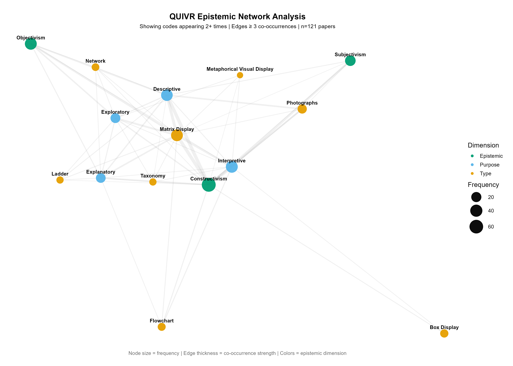

### 4.2 Type-Purpose Heatmaps by Epistemic Stance

``` r
triads <- long %>%
  select(.paper_id, dimension, label) %>%
  pivot_wider(names_from = dimension, values_from = label, values_fn = list) %>%
  unnest(Type, keep_empty = TRUE) %>%
  unnest(Purpose, keep_empty = TRUE) %>%
  unnest(Epistemic, keep_empty = TRUE) %>%
  filter(!is.na(Type), !is.na(Purpose), !is.na(Epistemic)) %>%
  mutate(
    Type      = gsub("^T: ", "", Type),
    Purpose   = gsub("^P: ", "", Purpose),
    Epistemic = gsub("^E: ", "", Epistemic)
  ) %>%
  count(Type, Purpose, Epistemic, name = "freq") %>%
  filter(freq >= 1)

epi_levels <- unique(triads$Epistemic)

make_heatmap <- function(epi) {
  plot_data <- triads %>%
    filter(Epistemic == epi) %>%
    complete(Type, Purpose, fill = list(freq = 0))

  ggplot(plot_data, aes(x = Type, y = Purpose, fill = freq)) +
    geom_tile(color = "white", linewidth = 0.5) +
    geom_text(
      aes(label = ifelse(freq > 0, freq, "")),
      color = "white",
      fontface = "bold",
      size = 4
    ) +
    scale_fill_gradient(
      low = "gray90",
      high = "#009E73",
      na.value = "white"
    ) +
    labs(
      title = paste("Triad Frequency:", epi),
      x = "Type",
      y = "Purpose",
      fill = "Frequency"
    ) +
    theme_minimal(base_size = 11) +
    theme(
      axis.text.x = element_text(angle = 45, hjust = 1, size = 9),
      axis.text.y = element_text(size = 9),
      panel.grid  = element_blank()
    )
}

heatmaps <- lapply(epi_levels, make_heatmap)
wrap_plots(heatmaps, ncol = 1)
```


------------------------------------------------------------------------

## 5. Reliability Analysis

### 5.1 Overview

Inter-rater reliability was assessed using: **Percent Agreement** between two raters, **Intraclass Correlation Coefficient (ICC)** for count variables - **Cohen's Kappa (κ)** for categorical epistemology variables

### 5.2 Percent Agreement

``` r
library(tidyverse)
setwd("D:/QUIVR")

# Read data
andrew <- read.csv("QUIVR rubric - Andrew Pass.csv")
marcus <- read.csv("QUIVR rubric - Marcus Pass.csv")
# Filter to matching rows
filter_andrew <- andrew %>%
  filter(Coder.intials %in% c(7, 56, 120, 67, 35, 27, 79, 65, 96, 116, 91, 19, 107, 106, 115, 95, 4, 104, 17, 105))
filter_marcus <- marcus %>%
  filter(Coder.intials %in% c(7, 56, 120, 67, 35, 27, 79, 65, 96, 116, 91, 19, 107, 106, 115, 95, 4, 104, 17, 105))
# Join
joined <- filter_andrew %>%
  inner_join(filter_marcus, by = "Coder.intials", suffix = c("_A", "_M"))
# Replace NA with 0
replace_na_0 <- function(x) {
  x <- as.character(x)
  x[is.na(x) | x == ""] <- "0"
  as.numeric(x)
}
# All columns to compare
cols <- c("Number.of.Figures", "Number.of.Tables", "Matrix.Display", "Network",
          "Flowchart", "Box.display", "Modified.Venn.Diagram", "Taxonomy",
          "Ladder", "Metaphorical.visual.display", "Decision.tree.model",
          "Data.Based.Graphs", "Mixed.Media", "Screenshots", "Other",
          "Video", "Non.visual.Audio", "Photographs", "Drawings",
          "Audience.Accessibility", "Descriptive", "Exploratory",
          "Explanatory", "Interpretive", "Persuasive", "Objectivism",
          "Constructivism", "Subjectivism")
# Store all agreements
all_agreements <- c()
# Calculate agreement for each
for (col in cols) {
  a_col <- paste0(col, "_A")
  m_col <- paste0(col, "_M")
  # CHECK IF COLUMNS EXIST FIRST
  if (a_col %in% names(joined) && m_col %in% names(joined)) {
    joined[[a_col]] <- replace_na_0(joined[[a_col]])
    joined[[m_col]] <- replace_na_0(joined[[m_col]])
    agreement <- mean(joined[[a_col]] == joined[[m_col]]) * 100
    all_agreements <- c(all_agreements, agreement)
    cat(col, ":", round(agreement, 1), "%\n")
  } else {
    cat(col, ": COLUMN NOT FOUND\n")
  }
Study reliability
study_reliability <- mean(all_agreements, na.rm = TRUE)
cat("Overall Agreement:", round(study_reliability, 1), "%\n")
```

### 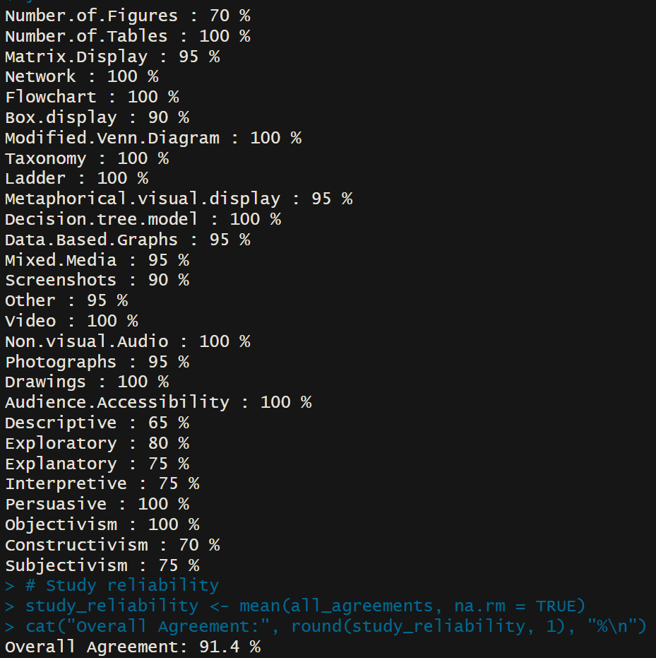

### 5.3 Variable Categories

### Code Setup

``` r
## Package Installation and Loading
knitr::opts_chunk$set(echo = TRUE, warning = FALSE, message = FALSE)

# Install required packages if not already installed
required_packages <- c("googlesheets4", "dplyr", "ggplot2", "tidyr", 
                       "stringr", "ggalluvial", "networkD3", "DT", 
                       "tm", "wordcloud", "googledrive", "plotly",
                       "FactoMineR", "factoextra", "irr", "Factoshiny")

for (pkg in required_packages) {
  if (!requireNamespace(pkg, quietly = TRUE)) {
    install.packages(pkg)
  }
}

# Load libraries
library(googlesheets4)
library(dplyr)
library(ggplot2)
library(tidyr)
library(stringr)
library(ggalluvial)
library(networkD3)
library(DT)
library(tm)
library(wordcloud)
library(googledrive)
library(plotly)
library(FactoMineR)
library(factoextra)
library(irr)
```

### Data Import

``` r
## Google Drive Authentication
drive_auth()

## Google Sheet ID
sheet_id <- "1thDJPIpLht-7heYNv6eOv85qChTM7xNIz7eFqibJUXI"

## Import Data
tryCatch({
  literature_data <- read_sheet(sheet_id, sheet = "Final Pass")
  definitions_data <- read_sheet(sheet_id, sheet = "Final Criteria Definitions")
  
  cat("==========\nLiterature Review Data\n==========\n")
  if (!is.null(literature_data) && nrow(literature_data) > 0) {
    glimpse(literature_data)
  }
  
  cat("\n==========\nCriteria Definitions Data\n==========\n")
  if (!is.null(definitions_data) && nrow(definitions_data) > 0) {
    glimpse(definitions_data)
  }
}, error = function(e) {
  cat("Error importing data:", e$message, "\n")
})
```

``` r
## COUNT VARIABLES (use ICC)
count_vars <- c(
  "Number.of.Figures", 
  "Number.of.Tables",
  "Matrix.Display", 
  "Network", 
  "Flowchart", 
  "Box.display", 
  "Modified.Venn.Diagram", 
  "Taxonomy", 
  "Ladder", 
  "Metaphorical.visual.display", 
  "Decision.tree.model",
  "Data.Based.Graphs", 
  "Mixed.Media", 
  "Screenshots", 
  "Other",
  "Video", 
  "Non.visual.Audio", 
  "Photographs", 
  "Drawings",
  "Audience.Accessibility",
  "Descriptive", 
  "Exploratory", 
  "Explanatory", 
  "Interpretive", 
  "Persuasive"
)

## EPISTEMOLOGY VARIABLES - CATEGORICAL (use Cohen's Kappa)
epistemo_vars <- c("Objectivism", "Constructivism", "Subjectivism")
```

### 5.4 ICC Analysis for Count Variables

``` r
## ICC FOR ALL COUNT VARIABLES
cat("\n╔═══════════════════════════════════════════════════════════╗\n")
cat("║  GROUP 1: COUNT VARIABLES (ICC)                          ║\n")
cat("║  (Includes figure/table counts, visual types, purposes)  ║\n")
cat("╚═══════════════════════════════════════════════════════════╝\n\n")

count_icc_results <- list()

for (col in count_vars) {
  if (col %in% names(filter_andrew) && col %in% names(filter_marcus)) {
    rater_data <- data.frame(
      Andrew = replace_na_0(filter_andrew[[col]]),
      Marcus = replace_na_0(filter_marcus[[col]])
    )
    
    icc_result <- icc(rater_data, model = "twoway", type = "agreement", unit = "single")
    count_icc_results[[col]] <- icc_result$value
    
    ## Show warning for problematic values
    warning_flag <- ""
    if (!is.na(icc_result$value)) {
      if (icc_result$value < 0) warning_flag <- " ⚠ NEGATIVE"
      else if (icc_result$value == 0) warning_flag <- " ⚠ ZERO"
      else if (icc_result$value < 0.40) warning_flag <- " ⚠ LOW"
    }
    
    cat(sprintf("%-35s ICC = %.3f (p = %.4f)%s\n", 
                col, icc_result$value, icc_result$p.value, warning_flag))
  }
}

cat(sprintf("\n→ Mean ICC for all count variables: %.3f (n=%d)\n", 
            mean(unlist(count_icc_results), na.rm = TRUE),
            length(count_icc_results)))
```


### 5.5 Cohen's Kappa for Epistemology Variables

``` r
## EPISTEMOLOGY VARIABLES - CATEGORICAL (Cohen's Kappa)
cat("\n╔═══════════════════════════════════════════════════════════╗\n")
cat("║  GROUP 2: EPISTEMOLOGY - CATEGORICAL (Cohen's Kappa)    ║\n")
cat("╚═══════════════════════════════════════════════════════════╝\n\n")

epistemo_kappa_results <- list()

for (col in epistemo_vars) {
  if (col %in% names(filter_andrew) && col %in% names(filter_marcus)) {
    rater_data <- data.frame(
      Andrew = as.factor(replace_na_0(filter_andrew[[col]])),
      Marcus = as.factor(replace_na_0(filter_marcus[[col]]))
    )
    
    kappa_result <- kappa2(rater_data, weight = "unweighted")
    epistemo_kappa_results[[col]] <- kappa_result$value
    
    ## Show warning for problematic values
    warning_flag <- ""
    if (!is.na(kappa_result$value)) {
      if (kappa_result$value < 0) warning_flag <- " ⚠ NEGATIVE"
      else if (kappa_result$value == 0) warning_flag <- " ⚠ ZERO"
      else if (kappa_result$value < 0.40) warning_flag <- " ⚠ LOW"
    }
    
    cat(sprintf("%-35s κ = %.3f (p = %.4f)%s\n", 
                col, kappa_result$value, kappa_result$p.value, warning_flag))
  }
}

cat(sprintf("\n→ Mean Kappa for epistemology variables: %.3f (n=%d)\n", 
            mean(unlist(epistemo_kappa_results), na.rm = TRUE),
            length(epistemo_kappa_results)))
```

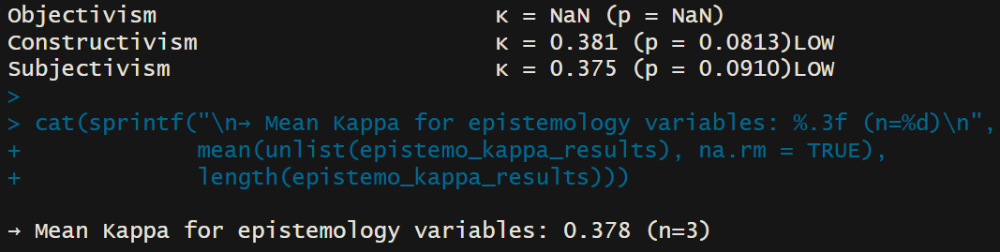

### 5.6 Summary Results

### 5.7 Interpretation Guide

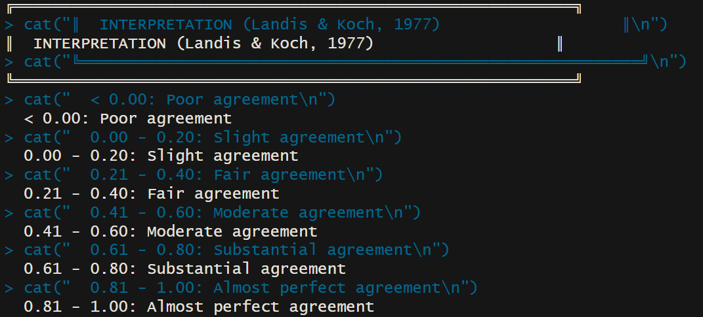

### 5.8 Key Findings

## 6. Multiple Correspondence Analysis (MCA)

### 6.1 Overview

MCA examines three-way relationships between epistemology, purpose, and visualization type.

### 6.2 Data Preparation

``` r
## Define variable groups
epistemology_cols <- c("Objectivism", "Constructivism", "Subjectivism")

purpose_cols <- c("Descriptive", "Exploratory", "Explanatory", 
                  "Interpretive", "Persuasive")

viz_type_cols <- c("Matrix Display", "Network", "Flowchart", "Box display",
                   "Modified Venn Diagram", "Taxonomy", "Ladder", 
                   "Metaphorical visual display", "Decision tree model",
                   "Screenshots", "Photographs", "Drawings")

## Combine all variables
all_categorical_cols <- c(epistemology_cols, purpose_cols, viz_type_cols)

## Prepare MCA data
mca_data_full <- literature_data %>%
  select(all_of(all_categorical_cols)) %>%
  mutate(across(everything(), ~as.numeric(as.character(.)))) %>%
  mutate(across(everything(), ~ifelse(is.na(.) | . == 0, "No", "Yes"))) %>%
  mutate(across(everything(), as.factor))

## Remove rows with all "No" values
mca_data_full_filtered <- mca_data_full[rowSums(mca_data_full == "Yes") > 0, ]

cat("=== 3-WAY MCA DATASET ===\n")
cat("Total observations:", nrow(mca_data_full_filtered), "\n")
cat("Epistemology variables:", length(epistemology_cols), "\n")
cat("Purpose variables:", length(purpose_cols), "\n")
cat("Visualization variables:", length(viz_type_cols), "\n")
cat("Total variables:", length(all_categorical_cols), "\n\n")
```

### 6.3 Perform MCA

``` r
## Perform comprehensive MCA
mca_full <- MCA(mca_data_full_filtered, graph = FALSE)

## Main biplot with all variables
fviz_mca_biplot(mca_full, 
                col.var = "contrib",
                gradient.cols = c("#00AFBB", "#E7B800", "#FC4E07"), 
                repel = TRUE,
                ggtheme = theme_minimal(),
                title = "Complete MCA - Epistemology + Purposes + Visualizations")

## Categories plot (without individuals)
fviz_mca_var(mca_full, 
             col.var = "cos2", 
             gradient.cols = c("white", "blue", "red"),
             repel = TRUE,
             title = "MCA Variable Categories")

## Interactive exploration (optional)
# Factoshiny(mca_full)
```

### 6.4 MCA Interpretation

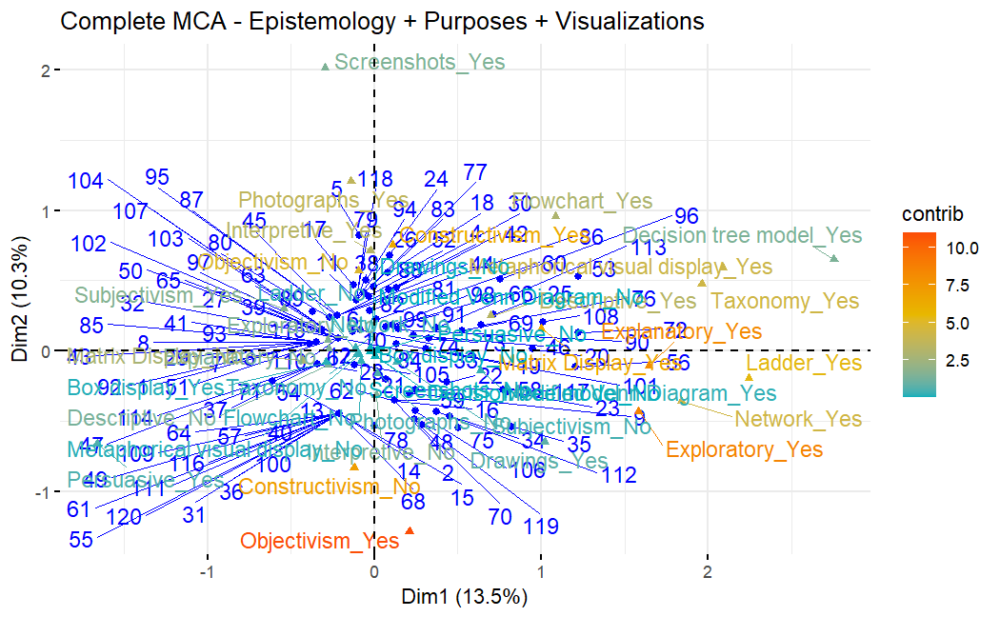

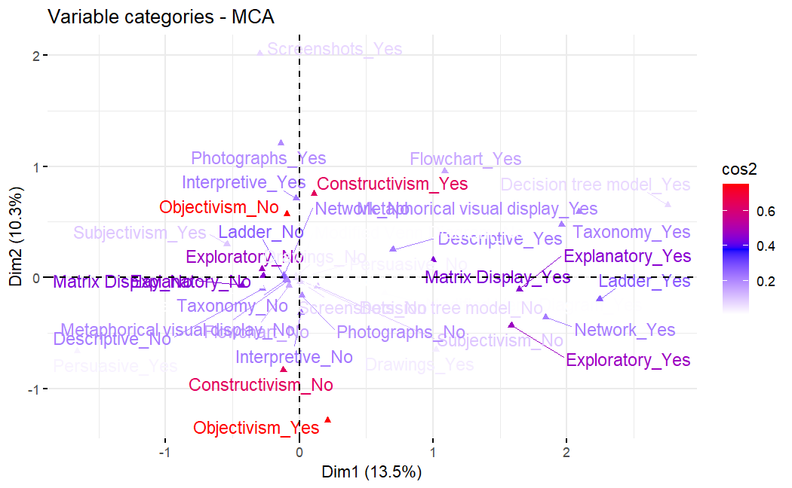

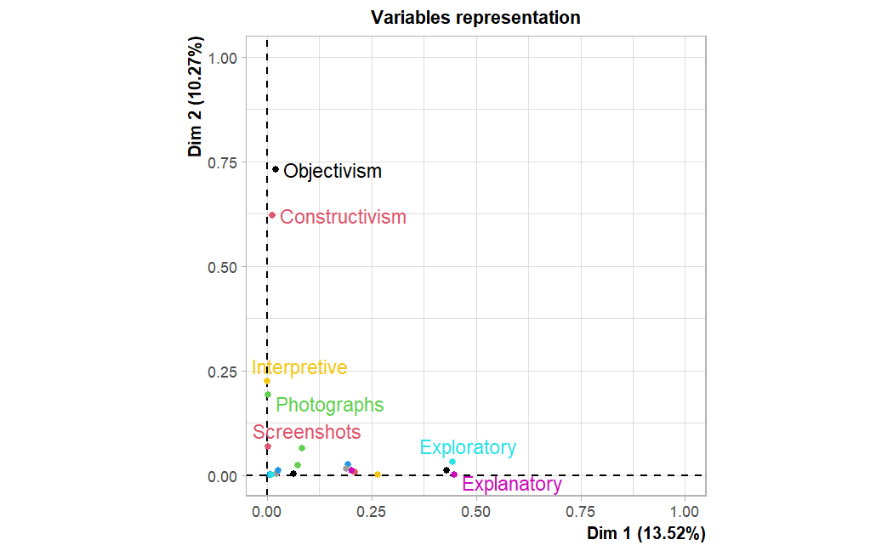

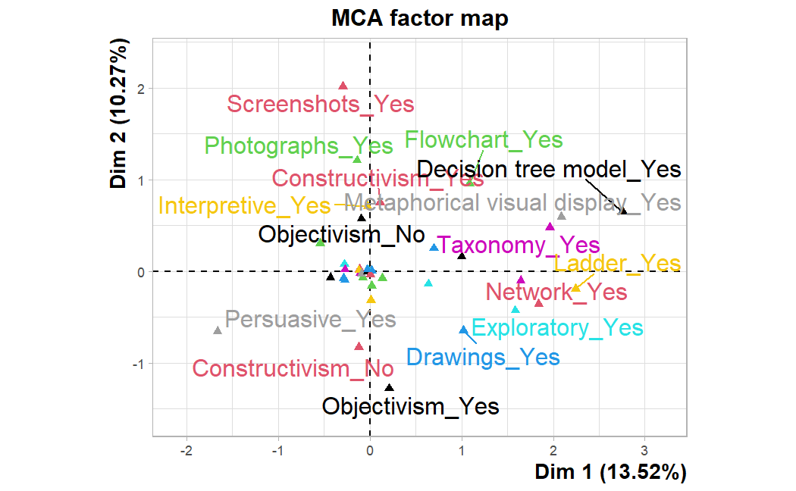

------------------------------------------------------------------------

## 7. Correspondence Analysis (CA)

### 7.1 Overview

CA examines two-way relationships between epistemology and visualization type.

### 7.2 CA Without Missing Data

Only papers with both epistemology AND figures:

``` r
## Transform data to long format
ca_data_long <- literature_data %>%
  mutate(paper_id = row_number()) %>%
  select(paper_id, all_of(c(epistemology_cols, viz_type_cols))) %>%
  mutate(across(-paper_id, ~as.numeric(as.character(.)))) %>%
  ## Convert to long format for epistemologies
  pivot_longer(
    cols = all_of(epistemology_cols),
    names_to = "Epistemology",
    values_to = "has_epistemology"
  ) %>%
  ## Keep only where epistemology = 1
  filter(has_epistemology == 1) %>%
  select(-has_epistemology) %>%
  ## Pivot longer for figure types
  pivot_longer(
    cols = all_of(viz_type_cols),
    names_to = "Figure_Type",
    values_to = "has_figure"
  ) %>%
  ## Keep only where figure = 1
  filter(has_figure == 1) %>%
  select(paper_id, Epistemology, Figure_Type)

## Create contingency table
contingency_table <- ca_data_long %>%
  group_by(Epistemology, Figure_Type) %>%
  summarise(count = n(), .groups = "drop") %>%
  pivot_wider(
    names_from = Figure_Type,
    values_from = count,
    values_fill = 0
  ) %>%
  column_to_rownames("Epistemology")

## Display contingency table
cat("=== CONTINGENCY TABLE: Epistemology x Figure Type ===\n")
print(contingency_table)
cat("\n")

## Perform CA
ca_result <- CA(contingency_table, graph = FALSE)

## Visualizations
fviz_ca_biplot(ca_result, 
               repel = TRUE,
               col.row = "blue",
               col.col = "red",
               ggtheme = theme_minimal(),
               title = "CA: Epistemology vs Figure Type")

fviz_screeplot(ca_result, 
               addlabels = TRUE, 
               title = "Variance Explained by CA Dimensions")

## Interactive exploration (optional)
# Factoshiny(ca_result)
```

### 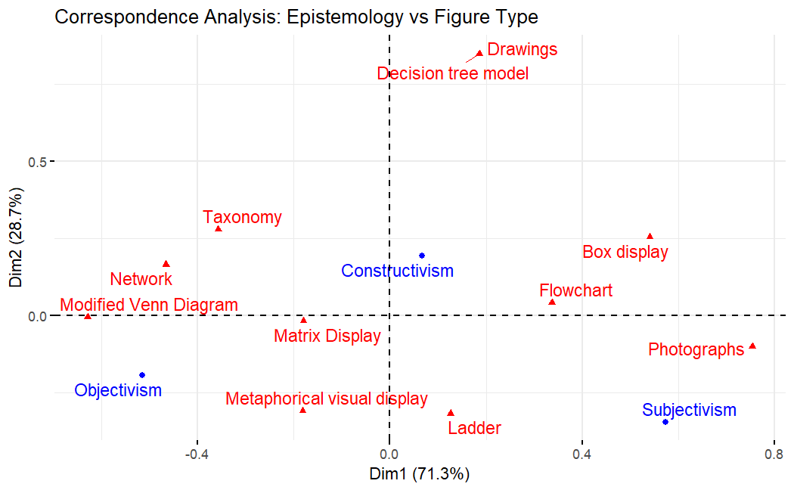 7.3 CA With Missing Data

Including "None" categories:

``` r
## Transform with explicit "None" categories
ca_data_long_missing <- literature_data %>%
  mutate(paper_id = row_number()) %>%
  select(paper_id, all_of(c(epistemology_cols, viz_type_cols))) %>%
  mutate(across(-paper_id, ~as.numeric(as.character(.)))) %>%
  ## Check if paper has ANY epistemology
  mutate(has_any_epistemology = rowSums(select(., all_of(epistemology_cols)), na.rm = TRUE) > 0) %>%
  ## Check if paper has ANY figure
  mutate(has_any_figure = rowSums(select(., all_of(viz_type_cols)), na.rm = TRUE) > 0) %>%
  ## Pivot epistemologies
  pivot_longer(
    cols = all_of(epistemology_cols),
    names_to = "Epistemology",
    values_to = "has_epistemology"
  ) %>%
  ## Keep epistemologies that = 1, OR if paper has no epistemology, add "None"
  filter(has_epistemology == 1 | (has_epistemology == 0 & !has_any_epistemology)) %>%
  mutate(Epistemology = ifelse(has_epistemology == 0, "None_Epistemology", Epistemology)) %>%
  select(-has_epistemology) %>%
  ## Pivot figures
  pivot_longer(
    cols = all_of(viz_type_cols),
    names_to = "Figure_Type",
    values_to = "has_figure"
  ) %>%
  ## Keep figures that = 1, OR if paper has no figure, add "None"
  filter(has_figure == 1 | (has_figure == 0 & !has_any_figure)) %>%
  mutate(Figure_Type = ifelse(has_figure == 0, "None_Figure", Figure_Type)) %>%
  select(paper_id, Epistemology, Figure_Type) %>%
  distinct()

## Create contingency table with "None"
contingency_table_missing <- ca_data_long_missing %>%
  group_by(Epistemology, Figure_Type) %>%
  summarise(count = n(), .groups = "drop") %>%
  pivot_wider(
    names_from = Figure_Type,
    values_from = count,
    values_fill = 0
  ) %>%
  column_to_rownames("Epistemology")

cat("=== CONTINGENCY TABLE WITH 'NONE' CATEGORIES ===\n")
print(contingency_table_missing)
cat("\n\nTotal combinations:", sum(contingency_table_missing), "\n\n")

## Perform CA with missing
ca_result_missing <- CA(contingency_table_missing, graph = FALSE)

fviz_ca_biplot(ca_result_missing, 
               repel = TRUE,
               col.row = "blue",
               col.col = "red",
               ggtheme = theme_minimal(),
               title = "CA: Epistemology vs Figure Type (Including 'None')")
```

### 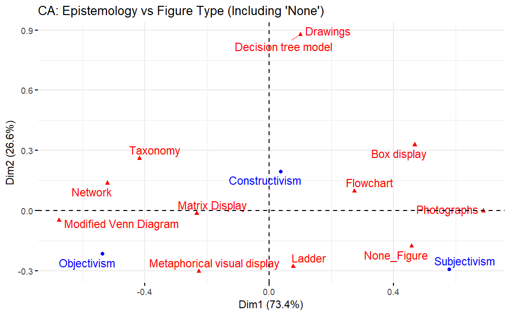 7.4 CA Interpretation

------------------------------------------------------------------------

## 8. Principal Component Analysis (PCA)

### 8.1 Overview

PCA performs dimensional reduction on figure count data to identify latent patterns.

### 8.2 PCA Without Missing Data

Filtered dataset:

``` r
## Prepare filtered data
pca_data_filtered <- literature_data %>%
  mutate(paper_id = row_number()) %>%
  select(paper_id, all_of(c(epistemology_cols, viz_type_cols))) %>%
  mutate(across(-paper_id, ~as.numeric(as.character(.)))) %>%
  mutate(across(-paper_id, ~replace_na(., 0))) %>%
  ## Filter: keep only papers with at least 1 epistemology AND 1 figure
  filter(
    rowSums(select(., all_of(epistemology_cols))) > 0 &
    rowSums(select(., all_of(viz_type_cols))) > 0
  )

## Prepare data matrix for PCA
pca_matrix <- pca_data_filtered %>%
  column_to_rownames("paper_id") %>%
  as.data.frame()

## Perform PCA
pca_result <- PCA(pca_matrix, 
                  scale.unit = TRUE,
                  ncp = 5,
                  graph = FALSE)

cat("=== PCA SUMMARY ===\n")
summary(pca_result)
cat("\n")

## Variable contribution plot
fviz_pca_var(pca_result,
             col.var = "contrib",
             gradient.cols = c("#00AFBB", "#E7B800", "#FC4E07"),
             repel = TRUE,
             title = "Variable Contributions to PC1 and PC2")

## Interactive exploration (optional)
# Factoshiny(pca_result)
```

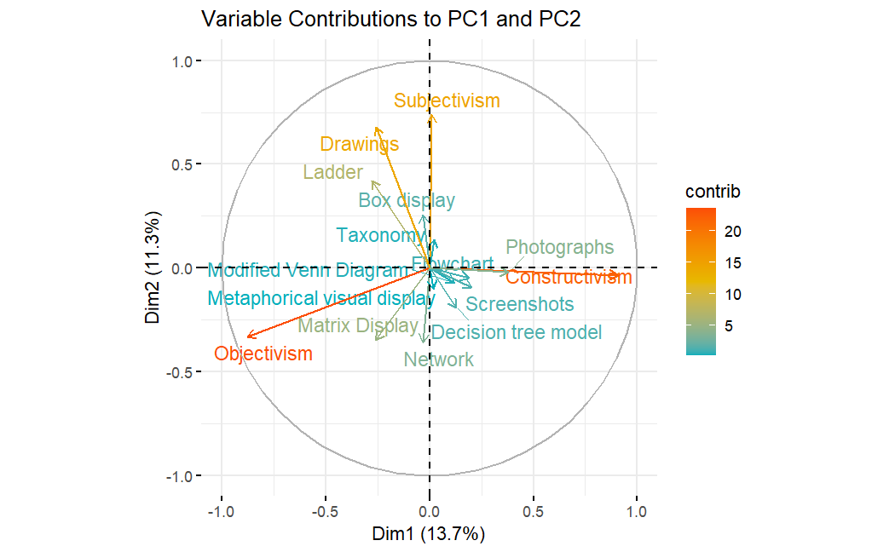

### 8.3 PCA With Missing Data

Complete dataset:

``` r
## Prepare complete data (including zeros)
pca_data_complete <- literature_data %>%
  mutate(paper_id = row_number()) %>%
  select(paper_id, all_of(c(epistemology_cols, viz_type_cols))) %>%
  mutate(across(-paper_id, ~as.numeric(as.character(.)))) %>%
  mutate(across(-paper_id, ~replace_na(., 0)))

cat("=== DATA SUMMARY FOR PCA (COMPLETE) ===\n")
cat("Number of papers:", nrow(pca_data_complete), "\n")
cat("Number of variables:", ncol(pca_data_complete) - 1, "\n\n")

cat("Figure Type Distribution:\n")
print(colSums(pca_data_complete[, viz_type_cols]))
cat("\n")

cat("Epistemology Distribution:\n")
print(colSums(pca_data_complete[, epistemology_cols]))
cat("\n\n")

## Prepare matrix
pca_matrix_complete <- pca_data_complete %>%
  column_to_rownames("paper_id") %>%
  as.data.frame()

## Perform PCA
pca_result_complete <- PCA(pca_matrix_complete, 
                           scale.unit = TRUE,
                           ncp = 5,
                           graph = FALSE)

## Visualizations
fviz_pca_var(pca_result_complete,
             col.var = "contrib",
             gradient.cols = c("#00AFBB", "#E7B800", "#FC4E07"),
             repel = TRUE,
             title = "PCA: Variable Contributions (Complete Dataset)")

# Factoshiny(pca_result_complete)
```

###  8.4 PCA Interpretation

------------------------------------------------------------------------

## 9. Discussion

### 9.1 Major Findings

[INSERT MAJOR FINDINGS]

### 9.2 Pattern Consistency Despite Low Reliability

Despite low inter-rater reliability for some variables, the multivariate analyses (MCA, CA, PCA) revealed consistent patterns: - Matrix displays dominate constructivist research - Photographs cluster with subjectivist approaches - Descriptive purposes align with specific epistemologies

### 9.3 Implications for Framework Development

------------------------------------------------------------------------

## 10. Recommendations

### 10.1 Framework Improvements

1.  **Allow multiple epistemological stances per paper**
    -   Many qualitative studies blend epistemological approaches
    -   Current forced-choice format may obscure nuance
2.  **Implement coder training protocols**
    -   Establish calibration sessions
    -   Use reference examples for borderline cases

### 10.2 Future Research Directions

1.  

------------------------------------------------------------------------

## 11. Conclusion

[INSERT CONCLUSION]

------------------------------------------------------------------------

## 12. References

Landis, J. R., & Koch, G. G. (1977). The measurement of observer agreement for categorical data. *Biometrics*, 33(1), 159-174.

Verdinelli, S., & Scagnoli, N. I. (2013). Data display in qualitative research. *International Journal of Qualitative Methods*, 12(1), 359-381.

#Not done

------------------------------------------------------------------------

*Report generated: [DATE]*\
*Analysis conducted using R version [VERSION]*
